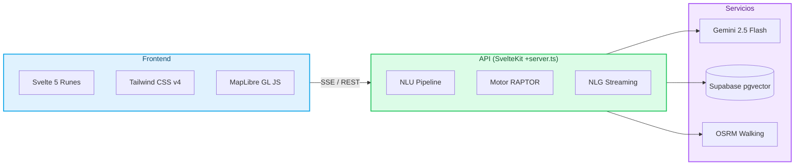

<div align="center">

# Neoleo Ruta

**Enrutamiento de transporte publico con IA para Monterrey, NL**

[](https://www.typescriptlang.org/)
[](https://kit.svelte.dev/)
[](https://svelte.dev/)
[](https://ai.google.dev/)
[](https://supabase.com/)
[](https://maplibre.org/)

*Encuentra tu camino en la Sultana del Norte con lenguaje natural y enrutamiento intermodal.*

</div>

---

## Qué es Neoleo Ruta

Neoleo Ruta es una app de movilidad para el área metropolitana de Monterrey. El usuario escribe consultas en lenguaje natural (ej. *"Como llego de la Uni a Fundidora?"*) y el sistema calcula la ruta óptima combinando Metro, Ecovía y Rutas Urbanas, dibuja el trayecto en un mapa interactivo y genera instrucciones paso a paso con jerga regia.

**Lo que la diferencia:**
- Entiende referencias locales informales mediante búsqueda semántica (RAG)
- Calcula rutas intermodales reales con el algoritmo RAPTOR
- Genera respuestas contextuales en streaming con tono regiomontano

## Cómo funciona

```mermaid
graph LR
    A[Entrada del usuario] --> B[NLU: Extraccion de intencion]
    B --> C[Geocodificacion + RAG]
    C --> D[RAPTOR: Calculo de ruta]
    D --> E[Gemini: NLG Streaming]
    E --> F[Mapa + Chat]

    style A fill:#e0f2fe,stroke:#0ea5e9,stroke-width:2px,color:#0c4a6e
    style B fill:#ffe4e6,stroke:#f43f5e,stroke-width:2px,color:#881337
    style C fill:#dcfce7,stroke:#22c55e,stroke-width:2px,color:#14532d
    style D fill:#f3e8ff,stroke:#a855f7,stroke-width:2px,color:#581c87
    style E fill:#fef3c7,stroke:#eab308,stroke-width:2px,color:#713f12
    style F fill:#bae6fd,stroke:#0284c7,stroke-width:2px,color:#075985
```



1. **NLU** — Regex rapido (<2ms) intenta extraer origen/destino. Si falla, Gemini genera un JSON estructurado (~800ms).
2. **Geocodificacion** — 3 capas: lugares conocidos hardcodeados, cache, Nominatim. Supabase pgvector resuelve referencias informales via busqueda semantica.
3. **RAPTOR** — Round-Based Public Transit Routing calcula la ruta optima sobre 461 paradas y 18 direcciones de ruta.
4. **Mapa** — El frontend dibuja el trayecto inmediatamente con MapLibre GL (GeoJSON + animacion de trazado secuencial).
5. **NLG** — Gemini 2.5 Flash genera instrucciones en streaming con jerga regia, transmitidas palabra por palabra al chat.

## Arquitectura



### Datos de transito

| Red | Rutas | Paradas | Transbordos |
|-----|-------|---------|-------------|
| Metro (L1, L2, L3) | 3 lineas (bidireccional) | ~80 estaciones | 3 nodos |
| Ecovia | 1 linea (bidireccional) | ~30 estaciones | 3 nodos |
| Rutas Urbanas | 5 rutas (ida + vuelta) | ~350 paradas | Via estaciones compartidas |
| **Total** | **18 direcciones** | **461 paradas** | **168 transferencias** |

Las rutas de autobus se generan automaticamente desde archivos KML via `scripts/generate-bus-routes.mjs`.

### Velocidades del motor

| Modo | Velocidad | Notas |
|------|-----------|-------|
| Metro | 583 m/min | |
| Ecovia | 417 m/min | |
| Autobus | 300 m/min | |
| Caminata | 80 m/min | Haversine x 1.4 factor de desvio |

## Stack tecnologico

| Capa | Tecnologia |
|------|-----------|
| Framework | SvelteKit 2 + Svelte 5 (Runes) |
| Lenguaje | TypeScript 5.9 (modo estricto) |
| Estilos | Tailwind CSS v4 |
| Mapa | MapLibre GL JS 5 |
| IA | Google Gemini 2.5 Flash via Vercel AI SDK |
| Base de datos | Supabase (PostgreSQL + pgvector) |
| Geocodificacion | Nominatim (fallback) + cache interno |
| Geometria peatonal | OSRM (timeout 2s, solo enriquecimiento visual) |
| Validacion | Zod 4 |
| Markdown | marked 17 |

## Instalacion

### Requisitos previos

- Node.js 20+
- Una cuenta de [Supabase](https://supabase.com/) con la extension `pgvector` habilitada
- Una API key de [Google AI Studio](https://aistudio.google.com/) (Gemini)

### Setup

```bash
# Clonar el repositorio
git clone https://github.com/tu-usuario/neoleo-ruta.git
cd neoleo-ruta

# Instalar dependencias
npm install

# Configurar variables de entorno
cp .env.example .env
# Editar .env con tus credenciales (ver seccion abajo)

# Inicializar la base de datos de lugares (RAG)
npx tsx seed.ts

# Iniciar servidor de desarrollo
npm run dev
```

### Variables de entorno

Crea un archivo `.env` en la raiz del proyecto:

```env
# Google Gemini
GEMINI_API_KEY=tu_api_key_de_google_ai_studio

# Supabase
PUBLIC_SUPABASE_URL=https://tu-proyecto.supabase.co
PUBLIC_SUPABASE_ANON_KEY=tu_anon_key
SUPABASE_SERVICE_ROLE_KEY=tu_service_role_key
```

### Scripts disponibles

| Comando | Descripcion |
|---------|-------------|
| `npm run dev` | Servidor de desarrollo con HMR |
| `npm run build` | Build de produccion |
| `npm run preview` | Preview del build |
| `npm run check` | Type-check con svelte-check |

## Rendimiento

| Metrica | Valor |
|---------|-------|
| NLU via Regex | <2ms |
| NLU via Gemini | ~800ms |
| Calculo RAPTOR | ~150-300ms |
| Mapa interactivo visible | ~1.5s |
| Inicio de streaming NLG | ~2s |

## Endpoints de API

| Ruta | Metodo | Descripcion |
|------|--------|-------------|
| `/api/route` | POST | NLU + RAPTOR + NLG — calcula ruta y genera instrucciones |
| `/api/chat` | POST | RAG + Gemini — chat general sobre transporte en Monterrey |

## Privacidad

- **Sin rastreo**: La ubicacion GPS se usa solo en el cliente para calculos inmediatos. No se almacena ni se envia a terceros.
- **Sin perfilamiento**: Las consultas se procesan en tiempo real sin almacenar historial ni PII.
- **Jerga segura**: La jerga regiomontana se incorpora via prompt engineering con limites claros.

## Estructura del proyecto

```
src/
  lib/
    components/     # Svelte components (MapLibreMap, ChatInterface, etc.)
    data/           # Datos estaticos de rutas y estaciones
    engine/         # RAPTOR: raptor.ts, raptorData.ts
    server/         # Logica server-only: geocoding, OSRM, planRoute
    stores/         # Svelte stores (mapStore)
  routes/
    +page.svelte    # Pagina principal
    api/route/      # Endpoint de enrutamiento
    api/chat/       # Endpoint de chat RAG
scripts/            # Generacion de rutas desde KML
```
