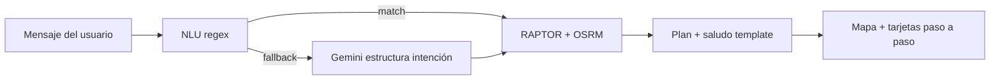

<div align="center">

# Neoleo Ruta

**Enrutamiento de transporte público con IA para Monterrey, NL**

[](https://kit.svelte.dev/)
[](https://svelte.dev/)
[](https://www.typescriptlang.org/)
[](LICENSE)

*Encuentra tu camino en la Sultana del Norte con lenguaje natural y enrutamiento intermodal.*

> ⚠️ **En desarrollo activo.** Primer release de pruebas.

</div>

---

## Qué es

Una app de movilidad para el área metropolitana de Monterrey. Escribe consultas en lenguaje natural (*"¿Cómo llego de la Uni a Fundidora?"*) y el sistema calcula la ruta óptima combinando Metro, Ecovía y rutas urbanas, dibuja el trayecto en un mapa interactivo y lo explica con jerga regia.

**Lo que la diferencia:**
- Entiende referencias locales informales mediante búsqueda semántica (RAG).
- Calcula rutas intermodales reales con el algoritmo RAPTOR.
- Tiempo total ~2-3 s del primer mensaje al mapa dibujado.

## Cómo funciona


```mermaid
graph LR
    A[Mensaje del usuario] --> B[NLU regex]
    B -- match --> D[RAPTOR + OSRM]
    B -- fallback --> C[Gemini estructura intención]
    C --> D
    D --> E[Plan + saludo template]
    E --> F[Mapa + tarjetas paso a paso]
```

1. **NLU regex** (~2 ms) intenta extraer origen/destino de patrones comunes. Si falla, **Gemini 2.5 Flash** genera un JSON estructurado.
2. **Geocodificación por capas**: diccionario local → cache → Nominatim → Photon. Casos ambiguos disparan disambiguación.
3. **RAPTOR** computa la ruta Pareto-óptima (tiempo + transbordos) sobre la red de transporte.
4. **OSRM** enriquece los tramos peatonales con geometría real (timeout 2 s).
5. **NLG**: la respuesta de chat es un **template determinista** con jerga regia. Gemini sólo se usa para Q&A general (`/api/chat`) sin ruta calculada.

## Stack

| Capa | Tecnología |
|------|-----------|
| Framework | SvelteKit 2 + Svelte 5 (Runes) |
| Lenguaje | TypeScript 5.9 |
| Estilos | Tailwind CSS v4 |
| Mapa | MapLibre GL JS 5 |
| IA | Gemini 2.5 Flash via Vercel AI SDK |
| Base de datos | Supabase (PostgreSQL + pgvector) |
| Geocoding | Nominatim + Photon (con retry y timeout) |
| Tests | Vitest |

Datos de tránsito: ~80 estaciones de Metro (3 líneas), ~30 de Ecovía, ~350 paradas en rutas urbanas. Las rutas de autobús se generan desde KML vía `scripts/generate-bus-routes.mjs`.

## Setup

Requiere Node 20+, una cuenta Supabase con `pgvector` habilitado y una API key de [Google AI Studio](https://aistudio.google.com/).

```bash
git clone https://github.com/Fraga9/NeoleoRuta.git
cd NeoleoRuta
npm install
cp .env.example .env       # rellena las credenciales
npx tsx seed.ts            # alimenta pgvector con lugares conocidos
npm run dev
```

Variables de entorno (`.env`):

```env
GEMINI_API_KEY=...
PUBLIC_SUPABASE_URL=https://tu-proyecto.supabase.co
PUBLIC_SUPABASE_ANON_KEY=...
SUPABASE_SERVICE_ROLE_KEY=...
```

Comandos relevantes: `npm run dev`, `npm run build`, `npm run check`, `npm run test`.

## Endpoints

- `POST /api/route` — NLU + RAPTOR. SSE streaming con `plan`, `routes-list`, `clarification`, `nlg-chunk` y `done`.
- `POST /api/chat` — Q&A general sobre transporte (tarifas, métodos de pago, horarios). Usa RAG sobre Supabase pgvector.

## Privacidad

La ubicación GPS se envía al servidor sólo durante la consulta (para sesgar el geocoder y calcular tramos peatonales). No se persiste, no se asocia a un usuario y no se reenvía a terceros más allá de Nominatim/Photon como parte de la geocodificación misma.

## Licencia

MIT — ver [LICENSE](LICENSE).
